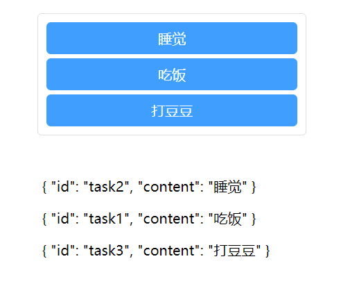
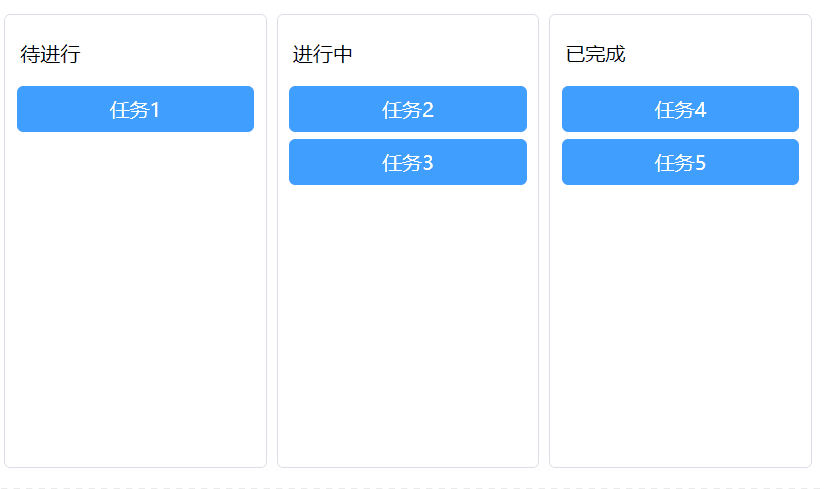

# Vue实现拖拽效果的方法

在前端开发中，交互方式是一个需要着重关注的内容。通过鼠标点击、键盘按键的各种组合，来方便快捷直观的进行操作，是提高网页交互体验的重点。网页内容拖拽操作，是一种符合直觉的操作，合理利用拖拽操作会让信息的获取和修改更为直观，为交互体验带来非常巨大的提升。

本文介绍在Vue3项目中，如何实现拖拽的效果，并附示例代码。

## 1、Drag API

### 1.1、简介

Drag API是H5的新功能，只需要对想拖拽的元素标签加上属性`draggable="true"`，就可以对元素进行自由拖拽了。

HTML的drag和drop使用了`DOM event model`以及从`mouse event`继承而来的`drag events`。一个典型的拖拽操作是这样的：用户选择一个可拖拽的（draggable）元素，并将其拖拽到一个可放置的（droppable）元素中，然后释放鼠标。

在拖拽中会处罚各种事件：

| 事件        | on型事件处理程序 | 描述                                                         |
| ----------- | ---------------- | ------------------------------------------------------------ |
| `drag`      | `ondrag`         | 当拖拽元素或选中的文本时触发。                               |
| `dragend`   | `ondragend`      | 当拖拽操作结束时触发 (比如松开鼠标按键或敲“Esc”键)。         |
| `dragenter` | `ondragenter`    | 当拖拽元素或选中的文本到一个可释放目标时触发。               |
| `dragleave` | `ondragleave`    | 当拖拽元素或选中的文本离开一个可释放目标时触发。             |
| `dragover`  | `ondragover`     | 当元素或选中的文本被拖到一个可释放目标上时触发（每 100 毫秒触发一次）。 |
| `dragstart` | `ondragstart`    | 当用户开始拖拽一个元素或选中的文本时触发。                   |
| `drop`      | `ondrop`         | 当元素或选中的文本在可释放目标上被释放时触发。               |

### 1.2、示例

利用Drag API我们可以很快写出拖拽操作，我们需要对Vue模板的拖拽元素标签，添加以下属性：

- `draggable="true"`
- `@dragstart="handleDragstart(index)"`
- `@dragenter="handleDragenter($event, index)"`

我们需要自己实现的就是`handleDragstart(index)`和`handleDragenter(e, index)`方法。下面是Vue3的代码示例：

```vue
<template>
  <div class="container">
    <ul>
        <li
          v-for="(task, index) in list"
          :key="task.id"
          draggable="true"
          @dragstart="handleDragstart(index)"
          @dragenter="handleDragenter($event, index)"
        >
          {{ task.content }}
        </li>
    </ul>
  </div>
</template>

<script setup>
import { ref } from "vue";

const list = ref([
  {
    id: "task1",
    content: "吃饭",
  },
  {
    id: "task2",
    content: "睡觉",
  },
  {
    id: "task3",
    content: "打豆豆",
  },
]);

// 记录当前拖拽选项的index
let dragIndex;

// 拖拽开始
function handleDragstart(index) {
  dragIndex = index;
}

// 经过元素进行交换
function handleDragenter(e, index) {
  e.preventDefault();
  // 避免源对象触发自身的dragenter事件
  if (dragIndex === index) {
	return
  }
  const source = list.value[dragIndex];
  list.value.splice(dragIndex, 1);
  list.value.splice(index, 0, source);
  // 排序变化后目标对象的索引变成源对象的索引
  dragIndex = index;
}
</script>

<style>
ul {
  width: 300px;
  /* height: 600px; */
  border: 1px solid #dcdfe6;
  border-radius: 5px;
  padding: 4px;
  list-style: none;
}

ul li {
  border-radius: 5px;
  margin: 5px;
  padding: 8px 0;
  text-align: center;
  background: #409eff;
  color: #fff;
  cursor: grab;
}
</style>
```

当然这样的移动很突然，非常的不优雅，我们可以为`v-for`遍历渲染的元素外包裹`transition-group`标签，为移动添加优雅的动画：

```vue
<template>
  <div class="container">
    <ul>
      <transition-group name="drag">
        <li
          v-for="(task, index) in list"
          :key="task.id"
          draggable="true"
          @dragstart="handleDragstart(index)"
          @dragenter="handleDragenter($event, index)"
        >
          {{ task.content }}
        </li>
      </transition-group>
    </ul>
  </div>
</template>

<script setup>
import { ref } from "vue";

const list = ref([
  {
    id: "task1",
    content: "吃饭",
  },
  {
    id: "task2",
    content: "睡觉",
  },
  {
    id: "task3",
    content: "打豆豆",
  },
]);

let dragIndex;

function handleDragstart(index) {
  dragIndex = index;
}

function handleDragenter(e, index) {
  e.preventDefault();
  // 避免源对象触发自身的dragenter事件
  if (dragIndex !== index) {
    const source = list.value[dragIndex];
    list.value.splice(dragIndex, 1);
    list.value.splice(index, 0, source);
    // 排序变化后目标对象的索引变成源对象的索引
    dragIndex = index;
  }
}
</script>

<style>
.container {
  display: flex;
  justify-content: center;
}

ul {
  width: 300px;
  /* height: 600px; */
  border: 1px solid #dcdfe6;
  border-radius: 5px;
  padding: 4px;
  list-style: none;
}

ul li {
  border-radius: 5px;
  margin: 5px;
  padding: 8px 0;
  text-align: center;
  background: #409eff;
  color: #fff;
  cursor: grab;
}

// 需要设置transition的css
.drag-move {
  transition: transform 0.3s;
}
</style>
```

最终的效果图：

 


## 2、vue.draggable.next

### 2.1、简介

上面介绍了原生Drag API配合Vue动画实现的拖拽效果，当然在项目中写原生还是太麻烦了，尤其遇到复杂的拖拽需求，写原生非常的伤脑筋。这时候就应该谷歌搜索一下有没有第三方好用的库了，所以vue.draggable.next库映入眼帘。

[vue-draggable-next中文文档](https://www.itxst.com/vue-draggable-next/tutorial.html)

[vue-draggable-next的GitHub地址](https://github.com/SortableJS/vue.draggable.next)

vue.draggable.next是vue.draggable适配vue3的升级版，基于Sortable.js实现。可以让我们非常优雅简单的实现拖拽效果。

### 2.2、API

| 属性名称            | 说明                                                         |
| :------------------ | :----------------------------------------------------------- |
| group               | 如果一个页面有多个拖拽区域，通过设置group名称可以实现多个区域之间相互拖拽 或者 `{ name: "...", pull: [true, false, 'clone', array , function], put: [true, false, array , function] }` |
| sort                | 是否开启排序,如果设置为false,它所在组无法排序                |
| delay               | 鼠标按下多少秒之后可以拖拽元素                               |
| touchStartThreshold | 鼠标按下移动多少px才能拖动元素                               |
| disabled            | `:disabled= "true"`,是否启用拖拽组件                         |
| animation           | 拖动时的动画效果，如设置`animation=1000`表示1秒过渡动画效果  |
| handle              | `:handle=".mover" `只有当鼠标在class为mover类的元素上才能触发拖到事件 |
| filter              | `:filter=".unmover"` 设置了unmover样式的元素不允许拖动       |
| draggable           | `:draggable=".item"` 样式类为item的元素才能被拖动            |
| ghost-class         | `:ghost-class="ghostClass" `设置拖动元素的占位符类名,你的自定义样式可能需要加!important才能生效，并把forceFallback属性设置成true |
| chosen-class        | `:ghost-class="hostClass"` 被选中目标的样式，你的自定义样式可能需要加!important才能生效，并把forceFallback属性设置成true |
| drag-class          | `:drag-class="dragClass"`拖动元素的样式，你的自定义样式可能需要加!important才能生效，并把forceFallback属性设置成true |
| force-fallback      | 默认false，忽略HTML5的拖拽行为，因为h5里有个属性也是可以拖动，你要自定义ghostClass chosenClass dragClass样式时，建议forceFallback设置为true |
| fallback-class      | 默认false，克隆选中元素的样式到跟随鼠标的样式                |
| fallback-on-body    | 默认false，克隆的元素添加到文档的body中                      |
| fallback-tolerance  | 按下鼠标移动多少个像素才能拖动元素，:fallback-tolerance="8"  |
| scroll              | 默认true,有滚动区域是否允许拖拽                              |
| scroll-fn           | 滚动回调函数                                                 |
| scroll-fensitivity  | 距离滚动区域多远时，滚动滚动条                               |
| scroll-speed        | 滚动速度                                                     |


### 2.3、安装

```shell
npm i -S vuedraggable@next
# or
yarn add vuedraggable@next
```

### 2.4、示例

本文将提供两个示例，一个类似刚刚原生实现的单列表拖拽，另一个实现多列表间拖拽。

#### 2.3.1、单列表

利用vue-draggable-next库可以非常快速实现单列表拖拽效果：

```vue
<template>
  <div class="container">
    <ul>
        <Draggable :list="list" animation="300" item-key="id">
          <template #item="{ element }">
            <li class="item">
              {{ element.content }}
            </li>
          </template>
        </Draggable>
    </ul>
  </div>
</template>

<script setup>
import { ref } from "vue";
import Draggable from 'vuedraggable'

const list = ref([
  {
    id: "task1",
    content: "吃饭",
  },
  {
    id: "task2",
    content: "睡觉",
  },
  {
    id: "task3",
    content: "打豆豆",
  },
]);
</script>

<style>
ul {
  width: 300px;
  /* height: 600px; */
  border: 1px solid #dcdfe6;
  border-radius: 5px;
  padding: 4px;
  list-style: none;
}

ul li {
  border-radius: 5px;
  margin: 5px;
  padding: 8px 0;
  text-align: center;
  background: #409eff;
  color: #fff;
  cursor: grab;
}
</style>
```

> 代码示例中，仅通过`Draggable`组件，设置`list`属性（数据列表）、`animation`属性（动画时间）和`item-key`属性（`v-for`的`key`字段名）就完成了单列表的拖拽效果，相比原生的实现，简单了非常多。

最终效果：

 

#### 2.3.2、多列表

多列表的示例将实现：三个不同的列表（待进行、进行中、已完成）间自由拖拽。

利用vue-draggable-next库可以非常快速的实现该效果，拓展单列表拖拽，我们只需要在多个拖拽组件中添加相同的`group`属性，就解决了，代码如下：

```vue
<template>
  <div class="container">
    <ul>
      <p>待进行</p>
      <Draggable class="drag-box" :list="list1" animation="300" group="task" item-key="id">
        <template #item="{ element }">
          <li class="item">
            {{ element.content }}
          </li>
        </template>
      </Draggable>
    </ul>
    <ul>
      <p>进行中</p>
      <Draggable class="drag-box" :list="list2" animation="300" group="task" item-key="id">
        <template #item="{ element }">
          <li class="item">
            {{ element.content }}
          </li>
        </template>
      </Draggable>
    </ul>
    <ul>
      <p>已完成</p>
      <Draggable class="drag-box" :list="list3" animation="300" group="task" item-key="id">
        <template #item="{ element }">
          <li class="item">
            {{ element.content }}
          </li>
        </template>
      </Draggable>
    </ul>
  </div>
</template>

<script setup>
import { ref } from "vue";
import Draggable from "vuedraggable";

const list1 = ref([
  {
    id: "task1",
    content: "任务1",
  },
]);
const list2 = ref([
  {
    id: "task2",
    content: "任务2",
  },
  {
    id: "task3",
    content: "任务3",
  },
]);
const list3 = ref([
  {
    id: "task4",
    content: "任务4",
  },
  {
    id: "task5",
    content: "任务5",
  },
]);
</script>

<style>
.container {
  display: flex;
}

ul {
  width: 200px;
  /* height: 400px; */
  margin-right: 8px;
  border: 1px solid #dcdfe6;
  border-radius: 5px;
  padding: 4px;
  list-style: none;
}

ul p {
  padding: 0 8px;
}

ul .drag-box {
  height: 300px;
}

ul li {
  border-radius: 5px;
  margin: 5px;
  padding: 8px 0;
  text-align: center;
  background: #409eff;
  color: #fff;
  cursor: grab;
}
</style>
```

最终效果：

 
